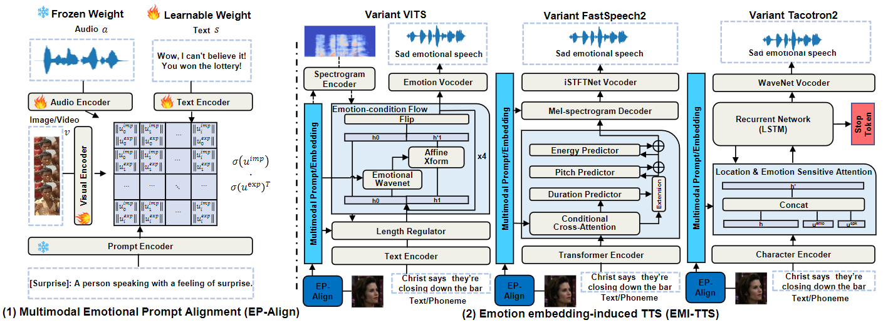

# UMETTS: A Unified Framework for Emotional Text-to-Speech Synthesis with Multimodal Prompts

* Coming soon: Our team is actively working on the latest code updates to provide better performance and functionality. Stay tuned as the new version will be released soon!

### Xiang Li, Zhi-Qi Cheng, Jun-Yan He, Junyao Chen, Xiaomao Fan, Xiaojiang Peng, Alexander G. Hauptmann

<p>
  <a href="https://kttrcdl.github.io/UMETTS/">
    </a>
  <a href="https://github.com/KTTRCDL/UMETTS/blob/main/LICENSE">
    </a>
</p>

<!-- In our recent [paper](https://arxiv.org/abs/2404.18398), we propose UMETTS: A Unified Framework for Emotional Text-to-Speech Synthesis with Multimodal Prompts. -->

Emotional Text-to-Speech (E-TTS) synthesis has garnered significant attention in recent years due to its potential to revolutionize human-computer interaction. However, current E-TTS approaches often struggle to capture the intricacies of human emotions, primarily relying on oversimplified emotional labels or single-modality input. In this paper, we introduce the Unified Multimodal Prompt-Induced Emotional Text-to-Speech System (UMETTS), a novel framework that leverages emotional cues from multiple modalities to generate highly expressive and emotionally resonant speech. The core of UMETTS consists of two key components: the Emotion Prompt Alignment Module (EP-Align) and the Emotion Embedding-Induced TTS Module(EMI-TTS). (1) EP-Align employs contrastive learning to align emotional features across text, audio, and visual modalities, ensuring a coherent fusion of multimodal information. (2)Subsequently, EMI-TTS integrates the aligned emotional embeddings with state-of-the-art TTS models to synthesize speech that accurately reflects the intended emotions. 

<!-- Visit our [demo]() for audio samples and we also provide the [pretrained models](). -->



## Pre-requisites

1. NVIDIA GPU
2. Python >= 3.7

## Setup
1. Clone this repository
    ```shell
    # SSH
    git clone --recursive git@github.com:KTTRCDL/UMETTS.git

    # HTTPS
    git clone --recursive https://github.com/KTTRCDL/UMETTS.git
    ```
2. Install python requirements. Please refer [requirements.txt](requirements.txt) for the complete list of dependencies.
    ```shell
    # requirements.txt
    pip install -r requirements.txt
    # CLIP
    pip install EPAlign/CLIP
    ```
3. Download datasets
    - Download and extract the Emotion Speech Dataset (ESD) following the instructions in the official repository [Emotional-Speech-Data](https://github.com/HLTSingapore/Emotional-Speech-Data)
    - Download and extract the Real-world Expression Database (RAF-DB) following the instructions in the official website [Real-world Affective Faces Database](http://www.whdeng.cn/raf/model1.html)
    - Download and extract the [Multimodal EmotionLines Dataset (MELD)](http://web.eecs.umich.edu/~mihalcea/downloads/MELD.Raw.tar.gz)
4. Preprocess the datasets
    - ESD: follow the jupyter notebook [preprocess/ESD.ipynb](preprocess/ESD.ipynb)
    <!-- - MELD: follow the jupyter notebook [preprocess/MELD.ipynb](preprocess/MELD.ipynb) -->
5. Download the Pretrained Models
    - [Waveglow](https://drive.google.com/open?id=1rpK8CzAAirq9sWZhe9nlfvxMF1dRgFbF) for Tacotron2 variant

## Train & Finetune
### Emotion Prompt Alignment Module (EP-Align)
1. Train the model
    
    follow the jupyter notebook [EPAlign/script/EPAlign_prompt_audio_finetune.ipynb](EPAlign/script/EPAlign_prompt_audio_finetune.ipynb), [EPAlign/script/EPAlign_prompt_vision_finetune.ipynb](EPAlign/script/EPAlign_prompt_vision_finetune.ipynb) and [EPAlign/script/EPAlign_prompt_fuse_finetune.ipynb](EPAlign/script/EPAlign_prompt_fuse_finetune.ipynb)

2. Extract the aligned emotional features
    
    follow the jupyter notebook [EPAlign/script/extract_emofeature.ipynb](EPAlign/script/extract_emofeature.ipynb)

### Emotion Embedding-Induced TTS (EMI-TTS)

Train the model
    
```shell
# Variant VITS
# Cython-version Monotonoic Alignment Search
cd EMITTS/VITS/model/monotonic_align
python setup.py build_ext --inplace
cd ../..
# path/to/json e.g. config/esd_en_e5.json, 
python train.py -c path/to/json -m esd_en

# Variant FastSpeech2
cd EMITTS/FastSpeech2
# need to change some path config in EMITTS/FastSpeech2/config/config.py file
python -m src.scripts.train

# Variant Tacotron2
cd EMITTS/Tacotron2
python train.py --output_directory=ckpt --log_directory=logs --multi_speaker --multi_emotion --emotion_feature
```

## Inference
### Emotion Prompt Alignment Module (EP-Align)
Follow the jupyter notebook [EPAlign/script/EPAlign_inference.ipynb](EPAlign/script/EPAlign_inference.ipynb)
### Emotion Embedding-Induced TTS (EMI-TTS)
  You should train the model to get the checkpoint files and extract the aligned emotional features before inference.
  - For VITS variant, follow the jupyter notebook [EMITTS/VITS/VITS_variant_inference.ipynb](EMITTS/VITS/VITS_variant_inference.ipynb)
  - For FastSpeech2 variant, follow the jupyter notebook [EMITTS/FastSpeech2/src/scripts/FastSpeech2_variant_inference.ipynb](EMITTS/FastSpeech2/src/scripts/FastSpeech2_variant_inference.ipynb)
  - For Tacotron2 variant, follow the jupyter notebook [EMITTS/Tacotron2/Tacotron2_variant_inference.ipynb](EMITTS/Tacotron2/Tacotron2_variant_inference.ipynb)

## NEW
We have limited resources for maintaining and updating the code. However, we are aware of the feedback regarding the checkpoints used in the inference code, and we are offering published checkpoints for three different variant models of EMI-TTS.

If you would like to obtain these checkpoints, Please click [HERE](https://drive.google.com/drive/folders/1yX5xPosn4jKM2W3avKfV8KGQfj7md9GA?usp=sharing) and include the message "Request for EMI-TTS published checkpoints" when accessing the shared Google Drive.

**Note**: After downloading the checkpoints to your project, please modify the relevant path/to/checkpoint in the inference code to ensure proper execution.

## Acknowledgement

This repository is based on [CLIP](https://github.com/openai/CLIP), [VITS](https://github.com/jaywalnut310/vits), [Tacotron2](https://github.com/NVIDIA/tacotron2), [FastSpeech2](https://github.com/ming024/FastSpeech2), and references the [Pytorch-DDP](https://github.com/pytorch/examples/tree/main/distributed/ddp-tutorial-series), [emospeech](https://github.com/deepvk/emospeech). We would like to thank the authors of these work for publicly releasing their code.

## Citation

If you find this work useful, please consider citing our paper:

```bibtex
@INPROCEEDINGS{10889012,
  author={Li, Xiang and Cheng, Zhi-Qi and He, Jun-Yan and Chen, Junyao and Fan, Xiaomao and Peng, Xiaojiang and Hauptmann, Alexander G.},
  booktitle={ICASSP 2025 - 2025 IEEE International Conference on Acoustics, Speech and Signal Processing (ICASSP)}, 
  title={UMETTS: A Unified Framework for Emotional Text-to-Speech Synthesis with Multimodal Prompts}, 
  year={2025},
  volume={},
  number={},
  pages={1-5},
  keywords={Human computer interaction;Visualization;Codes;Accuracy;Contrastive learning;Signal processing;Reproducibility of results;Acoustics;Text to speech;Speech processing;Emotional Text-to-Speech;Multimodal Synthesis;Contrastive Learning;Expressive Speech Synthesis;Human-Computer Interaction},
  doi={10.1109/ICASSP49660.2025.10889012}}
```


